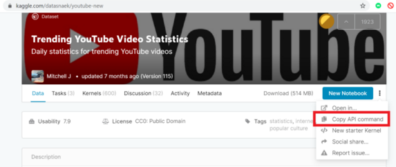

# Pneumonia_Classification
Pneumonia detection from the Chest X-ray data

   This project has been develeoped in Google Colab
    
   1. Open .ipynb file in Colab
    
   2. Download dataset from [Kaggle](https://www.kaggle.com/paultimothymooney/chest-xray-pneumonia/download) in Goggle Colab 
               
   Go to Your Account and click on Create New API Token
   
   A file named kaggle.json will get downloaded containing your username and token key
   
   Create a folder named Kaggle where we will be storing our Kaggle datasets
  
  Upload your kaggle.json file into Kaggle folder
        
   Run the following code to provide the config path to kaggle.json
         
         import os
     os.environ['KAGGLE_CONFIG_DIR'] = "/content/gdrive/My Drive/Kaggle"# /content/gdrive/My Drive/Kaggle is the path where kaggle.json is present in the Google Drive 
     
  3. Go to kaggle and copy the API Command to download the dataset
  
  

  
  4. Just paste it in the colab shell and your download will start soon
        
